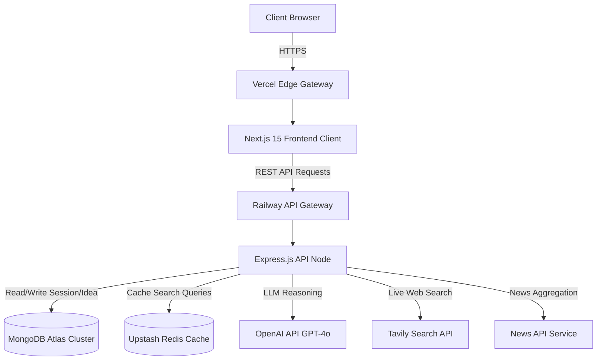
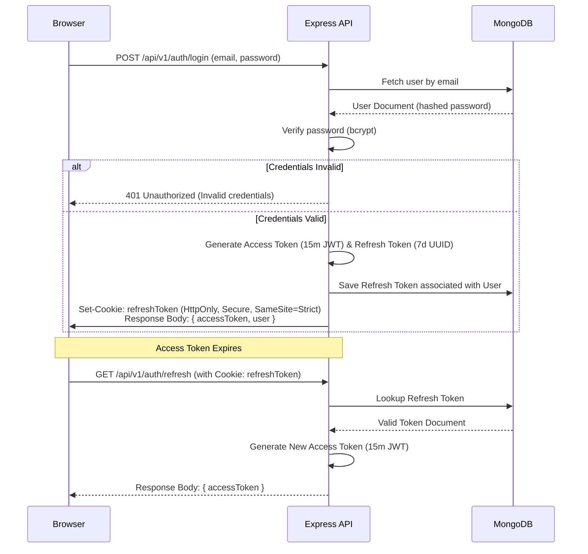
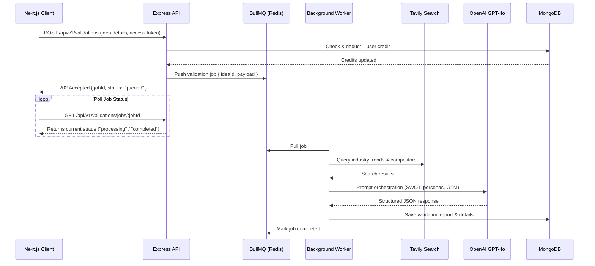
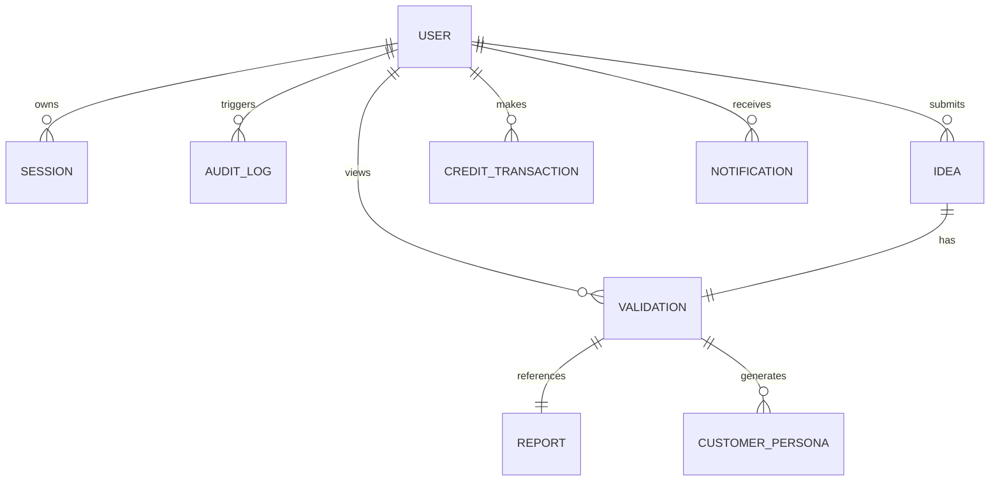

# Software Design Document: Product Validator AI

## Table of Contents
1. [Executive Summary](#1-executive-summary)
2. [Functional Requirements](#2-functional-requirements)
3. [Non-Functional Requirements](#3-non-functional-requirements)
4. [Complete High-Level Architecture](#4-complete-high-level-architecture)
5. [Project Folder Structure](#5-project-folder-structure)
6. [Database Design](#6-database-design)
7. [REST API Design](#7-rest-api-design)
8. [Frontend Architecture](#8-frontend-architecture)
9. [Backend Architecture](#9-backend-architecture)
10. [Authentication Design](#10-authentication-design)
11. [AI Architecture](#11-ai-architecture)
12. [External API Integration](#12-external-api-integration)
13. [Security Design](#13-security-design)
14. [Logging & Monitoring](#14-logging--monitoring)
15. [Error Handling](#15-error-handling)
16. [Testing Strategy](#16-testing-strategy)
17. [Docker Configs](#17-docker)
18. [CI/CD Pipeline](#18-cicd)
19. [Git Strategy](#19-git-strategy)
20. [Deployment Strategy](#20-deployment)
21. [Documentation Guidelines](#21-documentation)
22. [15-Day Development Roadmap](#22-development-roadmap)
23. [Future Improvements](#23-future-improvements)

---

## 1. Executive Summary

### Project Overview & Vision
**Product Validator AI** is a professional, production-grade SaaS platform designed to automate startup idea validation. Founders, product managers, and entrepreneurs frequently commit thousands of dollars and months of effort to ideas without rigorous validation. Product Validator AI bridges this gap, providing thorough, data-driven validation reports in minutes by combining LLM reasoning with real-time web search and structured business analysis.

### Problem Statement
Validating a startup idea currently requires manual market research, competitor benchmarking, SWOT compilation, and persona building, which is:
1. **Time-Consuming**: Takes days or weeks.
2. **Expensive**: Requires hiring expensive market research analysts.
3. **Biased**: Founders often rely on confirmation bias rather than objective data.

### Target Users
- **Solo Founders & Entrepreneurs**: Looking for rapid, objective validation of their ideas.
- **Product Managers & Strategists**: Needing rapid market analysis for new feature sets or products.
- **Accelerators & VC Associates**: Vetting batch applications or incoming pitches.

### Business Objectives
- Establish an interactive dashboard that takes simple inputs (idea, market target, budget) and returns comprehensive analyses.
- Build a credit-based monetization model (Stripe ready).
- Deliver exports (PDF) suitable for sharing with stakeholders/investors.

### Success Metrics
- **Performance**: Render pages in < 1.5s; complete complex background validation flows within 15 seconds.
- **Cost Efficiency**: Keep prompt design token usage optimized below $0.05 per standard report.
- **Convertibility**: Maintain a seamless dashboard experience to convert free trial users to premium tiers.

---

## 2. Functional Requirements

| ID | Feature Category | Description |
| :--- | :--- | :--- |
| **FR-1** | Authentication | JWT & Google OAuth2 signup/login. Secure tokens stored in HTTP-Only cookies. Password reset flow. |
| **FR-2** | Dashboard | Overview of previously submitted ideas, credit balances, search history, and saved reports. |
| **FR-3** | Idea Submission | Multi-step form validating startup idea title, description, target audience, industry, and budget range. |
| **FR-4** | AI Validation | Multi-stage orchestration engine to generate a validation score (1-100) based on feasibility, demand, and risk. |
| **FR-5** | Competitor Analysis | Live crawling via Tavily/Exa APIs to identify direct/indirect competitors, positioning, and market gaps. |
| **FR-6** | Market Research | Fetches recent industry trends, TAM/SAM/SOM estimates, and current news articles. |
| **FR-7** | SWOT Generator | Formulates structured Strengths, Weaknesses, Opportunities, and Threats based on market context. |
| **FR-8** | Customer Persona | Builds 2 detailed target customer personas including demographic, psychographic, and pain points. |
| **FR-9** | MVP Recommendation | Recommends a feature roadmap, tech stack, and rapid validation experiments. |
| **FR-10** | Go-To-Market (GTM) | Details acquisition channels, marketing messaging, and primary metrics to track. |
| **FR-11** | PDF Export | Compiles the full report into a clean, downloadable vector PDF formatted with corporate styling. |
| **FR-12** | Search History | Allows browsing and reloading previously generated reports from database history. |
| **FR-13** | Saved Reports | Users can bookmark or organize reports into project folders. |
| **FR-14** | User Profile | Update name, company details, avatar, and view transaction history. |
| **FR-15** | Settings | Configure notification preferences, theme toggle, and credit management. |

---

## 3. Non-Functional Requirements

### Performance
- **Client Render (FCP)**: First Contentful Paint < 1.0s using Next.js 15 Server-Side Rendering (SSR) and Edge Caching.
- **API Latency**: Express API endpoints respond in < 200ms (excluding live AI generation routes, which utilize streaming or background processing).
- **Caching**: Redis-backed cache layer for static third-party API results (Tavily/News API) with 24-hour TTL.

### Security
- **Data Protection**: Encrypt database at rest (MongoDB Atlas standard) and transit (TLS 1.3).
- **API Security**: Standard HTTP headers using `Helmet`. CORS configured to strictly allow only the client domain.
- **Validation**: Strict schema verification via Zod on both client forms and server routes.
- **SQL/NoSQL Injection**: Express sanitizer prevents MongoDB query selector injection.
- **Passwords**: Hashed using `bcrypt` with salt rounds of 12.

### Scalability & Availability
- **Stateless Services**: Express backend holds no session state. Scaling is achieved horizontally across Docker containers.
- **Database Pooling**: Configured Mongoose connection pools (default size 50) with auto-reconnection and exponential backoff retries.
- **Availability Target**: 99.9% uptime target using container replicas on Railway and Vercel Multi-Region Edge.

### Maintainability & Accessibility
- **Strict Linting**: ESLint strict configuration combined with Prettier code styling checks pre-commit.
- **Code Coverage**: Target of 80%+ unit test coverage on core utility services.
- **Accessibility**: UI elements fully WCAG 2.1 AA compliant, utilizing Radix UI (Shadcn primitives) with standard keyboard focus states.

---

## 4. Complete High-Level Architecture

### Overall System Diagram



### Authentication Flow (JWT with Cookie-based Refresh)



### Request Flow (AI Validation Job)



---

## 5. Project Folder Structure

We organize the project into two core directories: `client` and `backend`, sharing interfaces via compile-time TS bindings.

```
product-validator/
├── client/                     # Next.js App Router Frontend
│   ├── public/                 # Static assets, logos, fonts
│   ├── src/
│   │   ├── app/                # App router directories
│   │   │   ├── layout.tsx      # Root layout (Providers, Fonts, Theme)
│   │   │   ├── page.tsx        # Landing Page
│   │   │   ├── loading.tsx     # Suspense fallback
│   │   │   ├── error.tsx       # Root error boundary
│   │   │   ├── not-found.tsx   # 404 page
│   │   │   ├── (auth)/         # Grouped auth routes
│   │   │   │   ├── login/      # /login page
│   │   │   │   └── signup/     # /signup page
│   │   │   └── dashboard/      # Protected dashboard root
│   │   │       ├── page.tsx
│   │   │       └── reports/    # Report viewer subroute
│   │   ├── components/         # React components
│   │   │   ├── ui/             # Shadcn primitives (button, dialog, input)
│   │   │   ├── layout/         # Header, Sidebar, Footer components
│   │   │   └── dashboard/      # Custom charts, report panels
│   │   ├── hooks/              # Custom React hooks (useAuth, useValidation)
│   │   ├── lib/                # Configuration wrappers (axios, queryClient)
│   │   ├── services/           # HTTP network callers
│   │   ├── types/              # Frontend types
│   │   └── validators/         # Client-side form schemas (Zod)
│   ├── tailwind.config.ts      # Styles customization
│   ├── tsconfig.json           # Frontend compiler options
│   ├── package.json            # NPM scripts & clientside packages
│   └── .env.local              # Local environment variables
│
├── backend/                    # Express.js REST API
│   ├── src/
│   │   ├── config/             # DB & App static parameters
│   │   ├── controllers/        # Express handlers (parsers/responders)
│   │   ├── routes/             # Route mapping definitions
│   │   ├── middleware/         # Auth, Zod Validation, Errors
│   │   ├── models/             # Mongoose MongoDB Schemas
│   │   ├── services/           # Core business logic services
│   │   │   ├── ai/             # OpenAI wrappers
│   │   │   ├── search/         # Tavily & News API integrations
│   │   │   └── pdf/            # PDFKit compile script
│   │   ├── utils/              # Structured logs, helper classes
│   │   ├── types/              # Express request expansions
│   │   ├── validators/         # Server payload schemas (Zod)
│   │   └── server.ts           # App execution entrypoint
│   ├── tsconfig.json           # Backend compiler options
│   ├── package.json            # Server dependencies
│   └── .env                    # Secrets & variables config
│
├── docs/                       # Architecture details & specifications
├── .github/
│   └── workflows/
│       └── ci-cd.yml           # GitHub actions definitions
├── docker-compose.yml          # Containerized dev env orchestration
├── .gitignore
└── README.md
```

---

## 6. Database Design

### Mongoose Models

#### User Schema (`backend/src/models/user.model.ts`)
```typescript
import { Schema, model, Document } from 'mongoose';

export interface IUser extends Document {
  email: string;
  passwordHash?: string;
  googleId?: string;
  name: string;
  companyName?: string;
  credits: number;
  role: 'user' | 'admin';
  createdAt: Date;
  updatedAt: Date;
}

const UserSchema = new Schema<IUser>({
  email: { type: String, required: true, unique: true, index: true, lowercase: true },
  passwordHash: { type: String },
  googleId: { type: String, index: true },
  name: { type: String, required: true },
  companyName: { type: String },
  credits: { type: Number, default: 5 },
  role: { type: String, enum: ['user', 'admin'], default: 'user' }
}, { timestamps: true });

export const UserModel = model<IUser>('User', UserSchema);
```

#### Idea Schema (`backend/src/models/idea.model.ts`)
```typescript
import { Schema, model, Document } from 'mongoose';

export interface IIdea extends Document {
  userId: Schema.Types.ObjectId;
  title: string;
  description: string;
  targetAudience: string;
  industry: string;
  budgetRange: string;
  createdAt: Date;
}

const IdeaSchema = new Schema<IIdea>({
  userId: { type: Schema.Types.ObjectId, ref: 'User', required: true, index: true },
  title: { type: String, required: true, trim: true },
  description: { type: String, required: true },
  targetAudience: { type: String, required: true },
  industry: { type: String, required: true, index: true },
  budgetRange: { type: String, required: true }
}, { timestamps: true });

export const IdeaModel = model<IIdea>('Idea', IdeaSchema);
```

#### Validation Schema (`backend/src/models/validation.model.ts`)
```typescript
import { Schema, model, Document } from 'mongoose';

export interface IValidation extends Document {
  ideaId: Schema.Types.ObjectId;
  userId: Schema.Types.ObjectId;
  validationScore: number;
  feasibilityScore: number;
  marketDemandScore: number;
  riskScore: number;
  swotAnalysis: {
    strengths: string[];
    weaknesses: string[];
    opportunities: string[];
    threats: string[];
  };
  competitors: Array<{
    name: string;
    url?: string;
    description: string;
    strengths: string[];
    weaknesses: string[];
  }>;
  marketTrends: string[];
  createdAt: Date;
}

const ValidationSchema = new Schema<IValidation>({
  ideaId: { type: Schema.Types.ObjectId, ref: 'Idea', required: true, unique: true },
  userId: { type: Schema.Types.ObjectId, ref: 'User', required: true, index: true },
  validationScore: { type: Number, required: true },
  feasibilityScore: { type: Number, required: true },
  marketDemandScore: { type: Number, required: true },
  riskScore: { type: Number, required: true },
  swotAnalysis: {
    strengths: [{ type: String }],
    weaknesses: [{ type: String }],
    opportunities: [{ type: String }],
    threats: [{ type: String }]
  },
  competitors: [{
    name: { type: String, required: true },
    url: { type: String },
    description: { type: String, required: true },
    strengths: [{ type: String }],
    weaknesses: [{ type: String }]
  }],
  marketTrends: [{ type: String }]
}, { timestamps: true });

export const ValidationModel = model<IValidation>('Validation', ValidationSchema);
```

#### Report Schema (`backend/src/models/report.model.ts`)
```typescript
import { Schema, model, Document } from 'mongoose';

export interface IReport extends Document {
  validationId: Schema.Types.ObjectId;
  userId: Schema.Types.ObjectId;
  pdfUrl: string;
  status: 'generating' | 'ready' | 'failed';
  createdAt: Date;
}

const ReportSchema = new Schema<IReport>({
  validationId: { type: Schema.Types.ObjectId, ref: 'Validation', required: true, index: true },
  userId: { type: Schema.Types.ObjectId, ref: 'User', required: true, index: true },
  pdfUrl: { type: String },
  status: { type: String, enum: ['generating', 'ready', 'failed'], default: 'generating' }
}, { timestamps: true });

export const ReportModel = model<IReport>('Report', ReportSchema);
```

#### Customer Persona Schema (`backend/src/models/persona.model.ts`)
```typescript
import { Schema, model, Document } from 'mongoose';

export interface IPersona extends Document {
  validationId: Schema.Types.ObjectId;
  name: string;
  role: string;
  demographics: {
    age: number;
    income: string;
    education: string;
  };
  painPoints: string[];
  goals: string[];
  buyingBehavior: string;
}

const PersonaSchema = new Schema<IPersona>({
  validationId: { type: Schema.Types.ObjectId, ref: 'Validation', required: true, index: true },
  name: { type: String, required: true },
  role: { type: String, required: true },
  demographics: {
    age: { type: Number },
    income: { type: String },
    education: { type: String }
  },
  painPoints: [{ type: String }],
  goals: [{ type: String }],
  buyingBehavior: { type: String }
}, { timestamps: true });

export const PersonaModel = model<IPersona>('Persona', PersonaSchema);
```

#### Credits Schema (`backend/src/models/credit.model.ts`)
```typescript
import { Schema, model, Document } from 'mongoose';

export interface ICreditTransaction extends Document {
  userId: Schema.Types.ObjectId;
  amount: number;
  transactionType: 'purchase' | 'refund' | 'use';
  referenceId?: string; // Stripe checkout session ID or report ID
  createdAt: Date;
}

const CreditTransactionSchema = new Schema<ICreditTransaction>({
  userId: { type: Schema.Types.ObjectId, ref: 'User', required: true, index: true },
  amount: { type: Number, required: true },
  transactionType: { type: String, enum: ['purchase', 'refund', 'use'], required: true },
  referenceId: { type: String }
}, { timestamps: true });

export const CreditTransactionModel = model<ICreditTransaction>('CreditTransaction', CreditTransactionSchema);
```

#### Session Schema (`backend/src/models/session.model.ts`)
```typescript
import { Schema, model, Document } from 'mongoose';

export interface ISession extends Document {
  userId: Schema.Types.ObjectId;
  refreshToken: string;
  ipAddress: string;
  userAgent: string;
  expiresAt: Date;
  createdAt: Date;
}

const SessionSchema = new Schema<ISession>({
  userId: { type: Schema.Types.ObjectId, ref: 'User', required: true, index: true },
  refreshToken: { type: String, required: true, unique: true, index: true },
  ipAddress: { type: String },
  userAgent: { type: String },
  expiresAt: { type: Date, required: true }
}, { timestamps: true });

SessionSchema.index({ expiresAt: 1 }, { expireAfterSeconds: 0 }); // Auto purge expired sessions

export const SessionModel = model<ISession>('Session', SessionSchema);
```

#### Notifications Schema (`backend/src/models/notification.model.ts`)
```typescript
import { Schema, model, Document } from 'mongoose';

export interface INotification extends Document {
  userId: Schema.Types.ObjectId;
  title: string;
  message: string;
  read: boolean;
  type: 'info' | 'success' | 'alert';
  createdAt: Date;
}

const NotificationSchema = new Schema<INotification>({
  userId: { type: Schema.Types.ObjectId, ref: 'User', required: true, index: true },
  title: { type: String, required: true },
  message: { type: String, required: true },
  read: { type: Boolean, default: false },
  type: { type: String, enum: ['info', 'success', 'alert'], default: 'info' }
}, { timestamps: true });

export const NotificationModel = model<INotification>('Notification', NotificationSchema);
```

#### Audit Logs Schema (`backend/src/models/audit.model.ts`)
```typescript
import { Schema, model, Document } from 'mongoose';

export interface IAuditLog extends Document {
  userId?: Schema.Types.ObjectId;
  action: string;
  details: string;
  ipAddress: string;
  createdAt: Date;
}

const AuditLogSchema = new Schema<IAuditLog>({
  userId: { type: Schema.Types.ObjectId, ref: 'User', index: true },
  action: { type: String, required: true, index: true },
  details: { type: String, required: true },
  ipAddress: { type: String, required: true }
}, { timestamps: true });

export const AuditLogModel = model<IAuditLog>('AuditLog', AuditLogSchema);
```

### Entity-Relationship Diagram



---

## 7. REST API Design

### Base URL: `/api/v1`

### Authentication Endpoints

#### `POST /auth/register`
- **Description**: Registers a new user.
- **Auth Required**: No.
- **Request Body**:
  ```json
  {
    "email": "user@example.com",
    "password": "StrongPassword123!",
    "name": "Jane Doe"
  }
  ```
- **Response (201 Created)**:
  ```json
  {
    "success": true,
    "accessToken": "eyJhbGciOi...",
    "user": {
      "id": "60c72b2f9b1d8e2354890a12",
      "email": "user@example.com",
      "name": "Jane Doe",
      "credits": 5
    }
  }
  ```
- **Error Codes**: `400 Bad Request` (Zod validation failed, or email already registered).

#### `POST /auth/login`
- **Description**: Authenticates existing user. Set HttpOnly secure refresh token.
- **Auth Required**: No.
- **Request Body**:
  ```json
  {
    "email": "user@example.com",
    "password": "StrongPassword123!"
  }
  ```
- **Response (200 OK)**: Same as `/auth/register`.
- **Error Codes**: `401 Unauthorized` (Invalid credentials).

#### `POST /auth/refresh`
- **Description**: Validates refresh token cookie and issues a new access token.
- **Auth Required**: Cookie with `refreshToken` required.
- **Response (200 OK)**:
  ```json
  {
    "success": true,
    "accessToken": "eyJhbGciOi..."
  }
  ```
- **Error Codes**: `401 Unauthorized` (Expired or missing refresh token).

#### `POST /auth/logout`
- **Description**: Invalidates current refresh token in the database and clears cookie.
- **Auth Required**: Yes (Bearer Access Token + Refresh Cookie).
- **Response (200 OK)**:
  ```json
  {
    "success": true,
    "message": "Logged out successfully"
  }
  ```

---

### Idea & Validation Endpoints

#### `POST /validations`
- **Description**: Submits a startup idea and kicks off the background AI validation job. Deducts 1 credit.
- **Auth Required**: Yes.
- **Request Body**:
  ```json
  {
    "title": "Uber for Clean Water",
    "description": "An on-demand water delivery service using decentralized supply chain maps.",
    "targetAudience": "Families in developing countries with access to clean water challenges",
    "industry": "Clean Tech / Logistics",
    "budgetRange": "$5k - $20k"
  }
  ```
- **Response (202 Accepted)**:
  ```json
  {
    "success": true,
    "message": "Validation job successfully queued.",
    "jobId": "validation_job_991823",
    "ideaId": "60c72b2f9b1d8e2354890a20"
  }
  ```
- **Error Codes**: `400 Bad Request` (Invalid input parameters), `402 Payment Required` (Insufficient credits).

#### `GET /validations/jobs/:jobId`
- **Description**: Check current status of the background task.
- **Auth Required**: Yes.
- **Response (200 OK)**:
  ```json
  {
    "success": true,
    "status": "processing", // "queued" | "processing" | "completed" | "failed"
    "progress": 45,
    "error": null
  }
  ```

#### `GET /validations/:ideaId`
- **Description**: Retrieve the completed validation report for an idea.
- **Auth Required**: Yes.
- **Response (200 OK)**:
  ```json
  {
    "success": true,
    "data": {
      "id": "60c72b2f9b1d8e2354890a33",
      "idea": {
        "title": "Uber for Clean Water",
        "description": "..."
      },
      "validationScore": 78,
      "feasibilityScore": 85,
      "marketDemandScore": 70,
      "riskScore": 60,
      "swotAnalysis": { "strengths": [...], "weaknesses": [...], "opportunities": [...], "threats": [...] },
      "competitors": [ ... ],
      "marketTrends": [ ... ],
      "personas": [ ... ]
    }
  }
  ```

---

### Utility & Health Endpoints

#### `GET /health`
- **Description**: Returns server and dependencies status.
- **Auth Required**: No.
- **Response (200 OK)**:
  ```json
  {
    "success": true,
    "message": "Backend is running",
    "timestamp": "2026-07-06T15:10:00.000Z",
    "database": "connected",
    "uptime": "1543.25s"
  }
  ```

---

## 8. Frontend Architecture

The frontend is constructed using **Next.js 15 (App Router)** and **TypeScript**.

### Routing Design
- **Root Layout (`src/app/layout.tsx`)**: Imports Global Tailwind CSS. Injects providers (Theme Provider for dark mode, React Query Provider, Auth Context Provider).
- **Public Routes**:
  - `/` (Home/Landing page): High-impact glassmorphic dark-mode marketing page outlining features, conversion paths, and pricing.
  - `/login`, `/signup`: Single layout auth screens using Zod validation with React Hook Form.
- **Protected Routes**: Routed under `/dashboard/*`. A Next.js middleware file (`src/middleware.ts`) intercepts requests to `/dashboard` and checks for the session token; if invalid, it redirects to `/login`.

### State Management & Fetching
- **TanStack Query (React Query)**: Handles all backend API communication. Configured with a global stale-time of 2 minutes to minimize network payload duplicate requests.
- **Axios Custom Instance (`src/lib/axios.ts`)**: Custom client with base URL pointing to target endpoint. Includes an Axios Interceptor that handles access token injection and automatically triggers a refresh request via the cookie when receiving a `401 Unauthorized` token expiry.
- **React Hook Form**: Minimizes re-renders during text entry. Paired with Zod resolver for input validation.

### UI Themes & Micro-Animations
- **Tailwind CSS + Shadcn UI**: Clean components configured with standard CSS variables. We define a custom palette featuring deep slate (`#09090b`), accent purples, and high-tech cyan gradients.
- **Framer Motion**: Integrates layout page changes and fade-in animations on components to provide a high-end, premium desktop app feeling.

---

## 9. Backend Architecture

We adopt the strict **Controller-Service-Repository** pattern to isolate routing, business decisions, data modeling, and database updates.

```
Incoming Request
      │
      ▼
┌───────────┐
│  Router   │ (Path mapping & auth middleware application)
└─────┬─────┘
      │
      ▼
┌───────────┐
│Controller │ (Extract parameters, execute Zod validator, return HTTP status)
└─────┬─────┘
      │
      ▼
┌───────────┐
│  Service  │ (Core logic: execute API calls, compute validation score, audit log triggers)
└─────┬─────┘
      │
      ▼
┌───────────┐
│Repository │ (Database interaction wrapper via Mongoose model functions)
└─────┬─────┘
      │
      ▼
┌───────────┐
│ Database  │ (MongoDB Atlas)
└───────────┘
```

### Decoupled Core Services
- **AI Service**: Orchestrated engine translating parameters into API calls to OpenAI. Uses custom schemas inside prompts to get structured JSON outputs directly.
- **Search Service**: Interfaces with Tavily Search API. Pre-processes user idea keywords into optimized queries, filters irrelevant results, and extracts clean, relevant snippets for the LLM.
- **PDF Compile Service**: Employs `pdfkit` or `puppeteer-core` to draw vectors, charts, and tables from report data, saving results straight to an S3/Cloudinary destination bucket.

---

## 10. Authentication Design

We prioritize security by employing a modern, production-grade JWT model.

### Token Strategy
- **Access Token**: Short-lived (15 minutes). Transmitted via the `Authorization: Bearer <token>` header. Signed using asymmetric HS256 algorithm with a unique secret key `JWT_SECRET`.
- **Refresh Token**: Long-lived (7 days). Stored exclusively in an `HttpOnly`, `Secure`, `SameSite=Strict` cookie, keeping it inaccessible to client-side scripts to defend against Cross-Site Scripting (XSS).

### Verification & Sessions
- A dedicated collection (`sessions`) maps refresh tokens to users, enabling real-time session revocation (e.g., when a user chooses to log out of all active devices).
- **Google OAuth2**: Set up using a Google API project, allowing users to log in directly via Google Single Sign-On (SSO). The backend matches Google credentials with existing users or registers a new user with empty passwords.

---

## 11. AI Architecture

To prevent long, unstructured outputs, the AI logic is broken down into modular business generators.

```
       ┌────────────────────────┐
       │   Idea Validator Core  │
       └───────────┬────────────┘
                   │ Orchestrates
      ┌────────────┼────────────┬────────────┐
      ▼            ▼            ▼            ▼
┌──────────┐ ┌──────────┐ ┌──────────┐ ┌──────────┐
│   SWOT   │ │ Persona  │ │Competitor│ │  Market  │
│Generator │ │Generator │ │ Analyzer │ │ Analyzer │
└──────────┘ └──────────┘ └──────────┘ └──────────┘
```

- **Prompt Manager**: Centralized registry housing dynamic template files. Strict versioning avoids drift in prompt responses.
- **Structured JSON Engine**: Prompts instruct GPT-4o using JSON Schema formatting (Structured Outputs API) to guarantee the model answers in the exact format defined by TypeScript interfaces.
- **Token Tracker**: Logs the number of prompt tokens and completion tokens consumed per request. Saved directly in database logs to calculate accurate unit margins.

---

## 12. External API Integration

We integrate OpenAI, Tavily, News API, and Cloudinary.

### Configuration Parameters
- **Tavily API**: Configured for `advanced` depth to query structured data about competitors and industry trends.
- **News API**: Queries recent news articles relating to the startup industry, filtering out entries older than 30 days.

### Resiliency Measures
- **Rate Limit Resilience**: Implements token bucket algorithm limits on clients to avoid hitting third-party HTTP 429 exceptions.
- **Retry Mechanism**: Employs exponential backoff retries (maximum of 3 attempts, scaling from 500ms -> 2000ms -> 8000ms delay) using the `axios-retry` package.
- **Caching**: Queries for similar market terms are cached in Redis for 24 hours to avoid redundant, expensive API calls.

---

## 13. Security Design

We configure standard security mechanisms across the entire Express API stack.

- **Helmet**: Injects security headers including Content-Security-Policy (CSP), Strict-Transport-Security (HSTS), X-Frame-Options (Clickjacking defense), and X-Content-Type-Options.
- **Rate Limiting**: Globally restricted to 100 requests per 15 minutes per IP address. Submitting ideas (which triggers expensive LLM operations) is limited to 3 actions per hour per logged-in user.
- **NoSQL Injection**: Utilizes `express-mongo-sanitize` middleware to prevent MongoDB query selector manipulation (e.g., stripping characters starting with `$` or `.`).
- **Secret Management**: Environment variables validated at bootstrap time. The server crashes immediately if critical environment parameters are missing.

---

## 14. Logging & Monitoring

We implement structured log management instead of relying on `console.log`.

- **Pino Logger**: Structured JSON logger configured for high-performance indexing. Output contains timestamp, process ID, log level, and request UUIDs.
- **Correlation ID (Request ID)**: A middleware generates a unique transaction UUID (`X-Request-ID`) for every incoming request. This ID is passed to services and written in all log items, facilitating trace analysis across multiple execution calls.
- **Health check endpoint (`/health`)**: Actively probes MongoDB state (`mongoose.connection.readyState`) and returns HTTP 500 if the database is unreachable.

---

## 15. Error Handling

We implement a centralized, deterministic Express error handler.

### Base Custom Exception (`backend/src/utils/appError.ts`)
```typescript
export class AppError extends Error {
  public readonly statusCode: number;
  public readonly isOperational: boolean;

  constructor(message: string, statusCode: number, isOperational = true) {
    super(message);
    this.statusCode = statusCode;
    this.isOperational = isOperational;
    Error.captureStackTrace(this, this.constructor);
  }
}
```

### Standard Exceptions
- `BadRequestError`: HTTP 400.
- `UnauthorizedError`: HTTP 401.
- `ForbiddenError`: HTTP 403.
- `NotFoundError`: HTTP 404.
- `ConflictError`: HTTP 409 (e.g. duplicate keys).
- `InternalServerError`: HTTP 500.

### Global Error Handling Middleware (`backend/src/middleware/errorHandler.ts`)
Intercepts all thrown exceptions. If the error is an instance of `AppError`, it returns the status code and message. Otherwise, it logs the full stack trace to the structured logging database and returns a generic "Something went wrong" message to keep internal details secure.

---

## 16. Testing Strategy

### Testing Hierarchy
- **Unit Testing (Jest + Supertest)**: Focuses on verification of business functions, validations, utility helpers, and DB models in isolation.
- **Integration Testing**: Focuses on HTTP requests hitting actual test databases (MongoDB Memory Server).
- **Component Testing (Vitest + RTL)**: Validates individual React components (forms, visual indicators) inside the client.
- **E2E Testing (Playwright)**: Automates complete user flow scripts (signing up, creating an idea, waiting for validation to complete, downloading PDF).
- **Coverage Goal**: Maintain a minimum of 80% line coverage for services and controllers.

---

## 17. Docker

### Client Dockerfile (`client/Dockerfile`)
```dockerfile
# Multi-stage build for client
FROM node:20-alpine AS base
WORKDIR /app
COPY package*.json ./
RUN npm ci
COPY . .
RUN npm run build

FROM node:20-alpine AS runner
WORKDIR /app
ENV NODE_ENV=production
COPY --from=base /app/.next ./.next
COPY --from=base /app/public ./public
COPY --from=base /app/package*.json ./
RUN npm ci --only=production
EXPOSE 3000
CMD ["npm", "start"]
```

### Backend Dockerfile (`backend/Dockerfile`)
```dockerfile
FROM node:20-alpine AS builder
WORKDIR /app
COPY package*.json ./
RUN npm ci
COPY . .
RUN npm run build

FROM node:20-alpine AS runner
WORKDIR /app
ENV NODE_ENV=production
COPY --from=builder /app/dist ./dist
COPY --from=builder /app/package*.json ./
RUN npm ci --only=production
EXPOSE 5000
CMD ["node", "dist/server.js"]
```

### Local Dev Compose Config (`docker-compose.yml`)
```yaml
version: '3.8'

services:
  mongodb:
    image: mongo:6.0
    container_name: validator-mongo
    ports:
      - "27017:27017"
    volumes:
      - mongo-data:/data/db

  redis:
    image: redis:7.0-alpine
    container_name: validator-redis
    ports:
      - "6379:6379"
    volumes:
      - redis-data:/data

volumes:
  mongo-data:
  redis-data:
```

---

## 18. CI/CD Pipeline

We employ **GitHub Actions** for validation and continuous deployment.

### Workflows Configuration (`.github/workflows/ci-cd.yml`)
1. **Trigger**: Executes on every pull request targeting `develop` or `main`.
2. **Steps**:
   - Install dependencies.
   - Code Lint checking (`npm run lint`).
   - Strict Type checking (`npm run type-check`).
   - Run Test suites with coverage output validation.
   - Build validation binaries.
3. **Continuous Deployment (CD)**: Automatically deploys Next.js client to Vercel and backend Docker image to Railway upon successful merges to the `main` branch.

---

## 19. Git Strategy

We utilize standard **GitFlow** settings.

- **Branches**:
  - `main`: Reflects current production releases.
  - `develop`: Integration sandbox branch.
  - `feature/*`: Specific feature branches (e.g. `feature/jwt-auth`).
- **Commit Format (Conventional Commits)**:
  - `feat(api): add jwt token rotation support`
  - `fix(client): repair login page validation state`
  - `docs(db): clarify user model properties`
- **Code Review Checklist**:
  - Code compiles without TypeScript warnings.
  - Test suites execute successfully locally.
  - Critical database queries are indexed.

---

## 20. Deployment Strategy

### Infrastructure Setup
- **Next.js Frontend**: Hosted on Vercel for fast global asset delivery.
- **Express Backend**: Run on Railway as a containerized web service.
- **MongoDB Database**: Hosted on MongoDB Atlas (AWS M0/M10 cluster).

### Deployment Environment Variables
- `MONGODB_URI`: Atlas connection string.
- `JWT_SECRET`: Hexadecimal secure key.
- `OPENAI_API_KEY`: API access token.
- `TAVILY_API_KEY`: Search access token.
- `NEWS_API_KEY`: News aggregator token.

---

## 21. Documentation Guidelines

To keep document maintenance simple, the repository includes key reference documents:
- `README.md`: Central roadmap, dependencies checklist, quickstart commands.
- `docs/API.md`: Detailed endpoint definitions with sample requests and responses.
- `docs/Database.md`: Database structure mapping, indexing, and migration instructions.
- `docs/Contributing.md`: Setup requirements, lint rules, and PR guidelines.

---

## 22. 15-Day Development Roadmap

| Day | Phase | Objectives | Deliverables | Files Created | Interview Talking Points |
| :--- | :--- | :--- | :--- | :--- | :--- |
| **Day 1** | Foundation | Establish structure, configs, Git, health endpoints. | Clean monorepo foundation, ESLint/Prettier setup, express server, Mongoose connection. | `README.md`, `.gitignore`, `backend/src/server.ts`, `backend/src/config/db.ts` | Scalable folder structure, clean decoupled architecture, robust error catching configurations. |
| **Day 2** | DB & Auth Specs | Set Mongoose schemas and register routes. | User/Session models built, JWT utility sign/verify methods ready, Register/Login controllers. | `backend/src/models/user.model.ts`, `backend/src/routes/auth.routes.ts` | Securing sessions, mitigating XSS via HttpOnly Cookie-based Refresh Tokens. |
| **Day 3** | Auth Implementation | Complete Google OAuth integration & middleware. | Google Auth route working, authGuard middleware protecting resources. | `backend/src/middleware/auth.middleware.ts`, `backend/src/config/passport.ts` | Access vs. Refresh token lifecycles, stateless backend scaling. |
| **Day 4** | Idea Submission API | Build Idea schema validation. | Idea models registered, Zod validators filtering POST payloads. | `backend/src/models/idea.model.ts`, `backend/src/validators/idea.validator.ts` | Validating inputs at the API gateway layer to prevent database pollution. |
| **Day 5** | Core AI Service | Connect OpenAI prompt execution engine. | Prompt template manager active, structured GPT JSON output integration. | `backend/src/services/ai/openai.service.ts`, `backend/src/services/ai/prompts.ts` | Prompt versioning, handling AI parsing failures gracefully. |
| **Day 6** | Search APIs | Integrate Tavily/News API. | Search client with rate limits and exponential backoff retry. | `backend/src/services/search/tavily.service.ts`, `backend/src/services/search/news.service.ts` | API request failure management, data caching. |
| **Day 7** | AI Orchestration | Orchestrate validation components. | SWOT, Persona, Competitor analyses run concurrently. | `backend/src/services/ai/orchestrator.ts` | Asynchronous processing, scaling worker nodes, transaction limits. |
| **Day 8** | PDF Generation | Compile structural PDFs. | PDFKit compiles scores, charts, and tables into PDF. | `backend/src/services/pdf/pdf.service.ts` | Programmatic vector drawings in PDF, cloud object storage uploads. |
| **Day 9** | Next.js Setup | Initialize client with configuration. | Next.js App Router, Axios, TanStack Query, Tailwind dark mode. | `client/src/lib/axios.ts`, `client/src/app/layout.tsx` | Next.js 15 routing optimizations, query invalidation. |
| **Day 10** | Client Auth Pages | Build login & signup UI. | Auth views, Zod forms, error displaying. | `client/src/app/(auth)/login/page.tsx`, `client/src/app/(auth)/signup/page.tsx` | Accessible forms, input sanitization on the client. |
| **Day 11** | Idea Submission Form | Complete validation form. | Steps indicator, validation triggers. | `client/src/app/dashboard/new-idea/page.tsx` | Handling complex multi-step form states with React Hook Form. |
| **Day 12** | Dashboard Visuals | Display scores and charts. | Dashboard layout, Recharts data visualization. | `client/src/app/dashboard/page.tsx`, `client/src/components/dashboard/ScoreChart.tsx` | SVG responsive chart rendering, lazy-loading heavy UI elements. |
| **Day 13** | E2E Testing | Write tests. | Supertest API checks, Playwright end-to-end user tests. | `backend/tests/auth.test.ts`, `client/tests/e2e/auth.spec.ts` | Writing predictable testing mocks, database state cleanup. |
| **Day 14** | Containerization | Create Docker configs and CD pipelines. | Multistage Docker builds, CI test scripts passing. | `Dockerfile`, `docker-compose.yml`, `.github/workflows/ci-cd.yml` | Containerization benefits, automated image deployments. |
| **Day 15** | Polish & Deploy | Production launch. | Domain mapping, SSL setup, final sanity checks. | `docs/Deployment.md` | Pre-launch checklist, performance auditing. |

---

## 23. Future Improvements

1. **Redis Queue System (BullMQ)**: Transition from in-memory processing to a distributed job queue to handle large volumes of validation tasks.
2. **Stripe Subscription Billing**: Implement Stripe payments to sell credits dynamically.
3. **WebSockets Notifications**: Integrate `socket.io` to update users in real time as their validation reports complete.
4. **AI Memory Profiling**: Let the model recall previous user reports to compile deeper context when validating new ideas in similar industries.
5. **Multi-Language Generation**: Translate PDF reports automatically based on user localization parameters.
